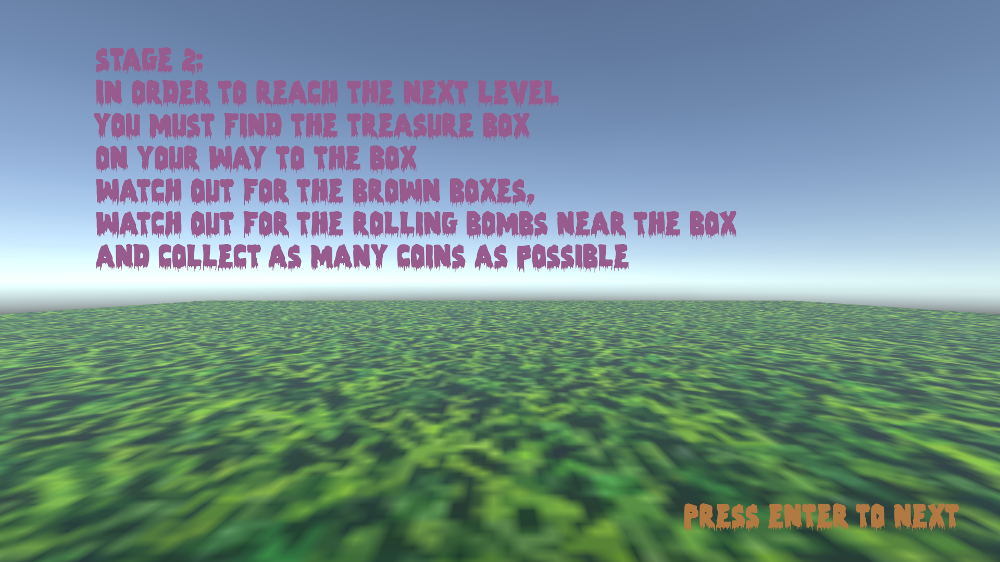

# 🕹️ Treasure Chest Game 🕹️

**Treasure Chest** is an exciting, multi-level computer game where players embark on a thrilling adventure to find a hidden treasure chest at each stage! This game is developed using **Unity** and **C#**, with 3D elements created in **Blender**.

# 🗂️ Table of Contents

1. [Game Overview](#-game-overview)
2. [How to Play](#-how-to-play)
3. [Tech Stack & Skills](#%EF%B8%8F-tech-stack--skills)
4. [Game Previews](#%EF%B8%8F-game-previews)
5. [Start Playing](#-start-playing)

## 🌟 Game Overview

Treasure Chest challenges players to navigate through three unique levels, each with its own set of obstacles and surprises:

- **Goal**: Reach the treasure chest to complete each level and advance to the next.
- **Challenges**: Each level introduces new obstacles such as traps, enemies, and other challenges.
- **Difficulty**: Levels become progressively more challenging.
- **Score**: Earn points based on performance in each level.

Players receive instructions at the start of each level, including hints on avoiding obstacles and tips for locating the treasure chest. The further they advance, the more intense and rewarding the journey becomes!

## 🎮 How to Play

1. **Read the Level Instructions**: Each level starts with a guide outlining obstacles and goals.
2. **Find the Treasure**: Reach the treasure chest by navigating through enemies, traps, and barriers.
3. **Avoid Losing**: If you collide with obstacles or get caught by an enemy, the level restarts (but not the entire game).
4. **Advance to Next Level**: Once you find the chest, progress to the next, more challenging level.
5. **Score Points**: Earn points and compete for the highest score!

## 🛠️ Tech Stack & Skills

This game was built using the following technologies:

- **Unity** - Game engine for creating immersive 2D and 3D games.
- **C#** - Primary language for game logic and mechanics.
- **Blender** - Used for creating 3D models and textures for game assets.

## 🖼️ Game Previews

### Opening Screen

### Level 1

### Level 2

### Level 3

### Game Over Screen
When the player loses, the level restarts.

### Victory Screen
When the player wins, they move on to the next level. If it's the final level, the game begins again.
- **Victory after a certain level**:
  
- **Victory after the final level**:
  

## 🚀 Start Playing

### For Developers:
1. **Clone the repository**: Clone the repository to your local machine.
2. **Open in Unity**: Open the project in Unity to explore the code and modify it as you wish!

### For Gamers:
1. **Download the Build**: Navigate to the `Build` folder in the repository.
2. **Play the Game**: Open the game file located in the `Build` folder to start your adventure. **Do not open any other project files**; use only the files in the `Build` folder to play.